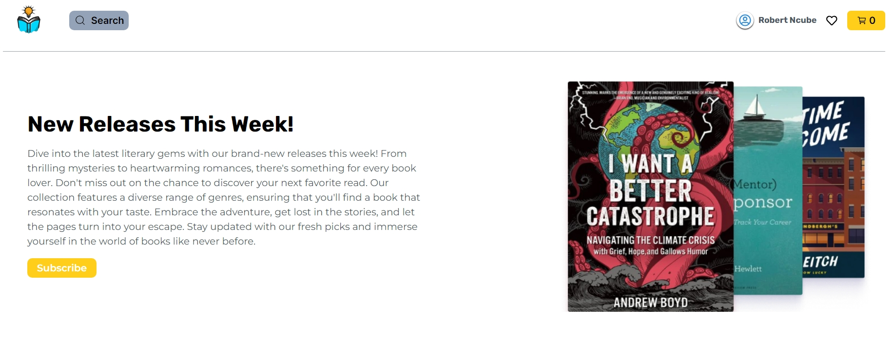
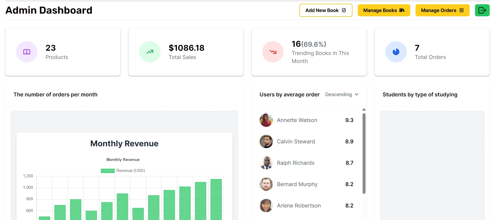

# 📚 Booknerd - Full-Stack Bookstore Platform

 
 


A modern MERN stack e-commerce platform for book enthusiasts, featuring user authentication, cart management, and a powerful admin dashboard.

[](https://booknerdstore.vercel.app)  
*Replace [IMAGE1] with hero screenshot of your site*

## 🚀 Features

### User Features
- 🔐 Firebase Authentication (Login/Signup)
- 🛒 Add to Cart & Checkout (Payment-on-Delivery)
- ❤️ Favorite Books Collection
- 📦 Order Tracking (Pending → Delivered)

### Admin Dashboard
- 📊 Sales Analytics & Order Management
- 🛠️ CRUD Operations for Books
- 📈 Real-time Status Updates (Pending/Confirmed/Shipped/Delivered/Cancelled)
- 👥 Admin Privilege System (*Work in Progress: View-Only Mode*)

[](https://booknerdstore.vercel.app)  
*Replace [IMAGE2] with admin dashboard screenshot*

## ⚙️ Tech Stack

**Frontend**  
 
 


**Backend**  
 
 


**Utilities**  
 
 


## 🛠️ Installation

1. **Clone the repository**
   ```bash
   git clone https://github.com/Robert-Ncube/Booknerd.git
   cd Booknerd
   
2. **Install Dependencies**
   ```bash
   cd booknerd/server && npm install
   cd ../client && npm install
  
3. **Environment Setup**
    ```bash
   # Create .env in /booknerd/server
   - PORT=5000
   - MONGODB_URI=your_mongodb_connection_string
   - JWT_SECRET=your_jwt_secret_key
    
   # Create .env in /booknerd/client
   - VITE_NODE_ENV=dev
   - VITE_FIREBASE_API_KEY=your_firebase_key
   - VITE_FIREBASE_AUTH_DOMAIN=your_firebase_domain
   - VITE_FIREBASE_PROJECT_ID=your_project_id
   - VITE_FIREBASE_STORAGE_BUCKET=your_bucket
   - VITE_FIREBASE_SENDER_ID=your_sender_id
   - VITE_FIREBASE_APP_ID=your_app_id
   - VITE_FIREBASE_MESUREMENT_ID=your_measurement_id

5. **Start Development Servers**
   ```bash
   # Backend (from /booknerd-server)
   npm run dev
   
   # Frontend (from /client)
   npm run dev

## 🔑 Environment Variables Usage

| Variable                     | Location                  | Purpose                          |
|------------------------------|---------------------------|----------------------------------|
| `PORT`                       | `server.js`               | Backend server port              |
| `MONGODB_URI`                | `server.js`               | MongoDB connection string        |
| `JWT_SECRET`                 | `AdminUserController.js`  | Admin auth token signing         |
| `VITE_FIREBASE_*`            | `firebase.js`             | Firebase client configuration    |

## 🌐 Deployment

Both frontend and backend are deployed via **Vercel**:  
🔗 Live Site: [https://booknerdstore.vercel.app](https://booknerdstore.vercel.app)

## 🚧 Upcoming Features
- 📰 News/Blog Section
- 👀 View-Only Admin Dashboard for Privileged Users
- 📦 Order Return/Refund System

## 👨💻 Author & Maintenance
**Robert Ncube**  
[](https://github.com/Robert-Ncube)  
📧 *Contact for support or contributions*

## 📄 License
This project is licensed under the **ISC License** - see [LICENSE](LICENSE) for details.
